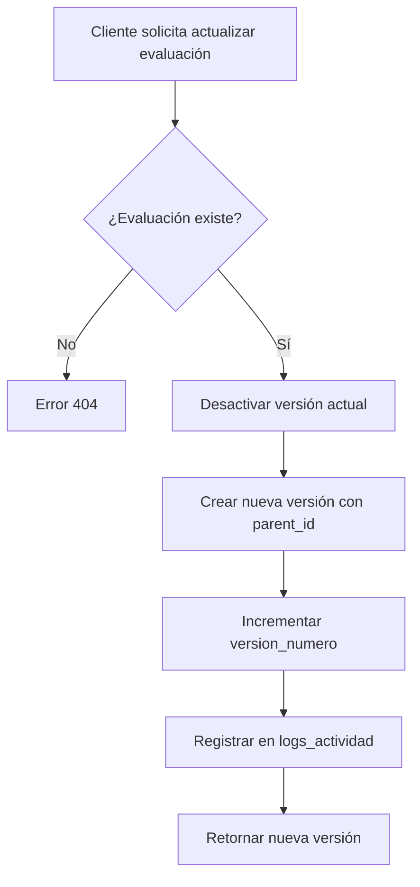
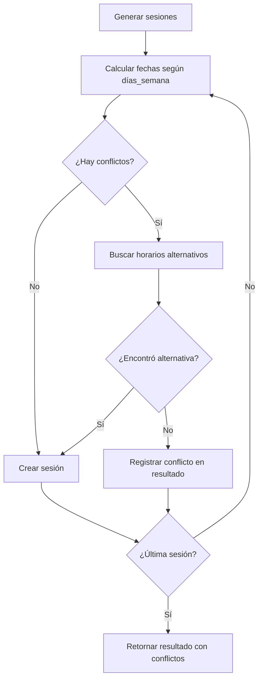

# Mejoras del Backend - FisioLab v2.0

## 📋 Tabla de Contenidos
- [Resumen Ejecutivo](#resumen-ejecutivo)
- [Arquitectura Implementada](#arquitectura-implementada)
- [Instalación y Configuración](#instalación-y-configuración)
- [Guía de Uso](#guía-de-uso)
- [API Documentation](#api-documentation)
- [Testing](#testing)
- [Troubleshooting](#troubleshooting)

---

## 🎯 Resumen Ejecutivo

### Funcionalidades Implementadas

✅ **Arquitectura de Datos Inmutable (SQL)**
- Sistema de versionado para evaluaciones físicas
- Triggers automáticos para actualizar timestamps y estados
- Constraints y validaciones a nivel de base de datos
- Vistas optimizadas para consultas comunes

✅ **Servicio de Versionado**
- Creación automática de nuevas versiones al actualizar evaluaciones
- Historial completo preservado (nunca se elimina data)
- Comparación entre versiones con diff estructurado
- Recuperación de versión activa por paciente

✅ **Smart Scheduling Algorithm**
- Generación automática de sesiones basada en frecuencia semanal
- Detección inteligente de conflictos de horario
- Propuesta automática de horarios alternativos
- Reprogramación de sesiones con historial de cambios

✅ **Sistema de Auditoría Completa**
- Logging automático de todas las mutaciones (CREATE, UPDATE, DELETE)
- Captura de datos antes/después de cada cambio
- Registro de IP, user agent, y usuario responsable
- Exportación de logs a CSV para auditorías

✅ **Principios de Diseño REST API**
- Respuestas consistentes con apiResponse.js utilities
- Códigos HTTP apropiados (200, 201, 204, 400, 404, 422, 500)
- Manejo global de errores con errorHandler.js
- Validación exhaustiva con validators.js middleware

---

## 🏗️ Arquitectura Implementada

### Estructura de Archivos

```
backend/
├── api/
│   ├── src/
│   │   ├── config/
│   │   │   └── database.js                    # Configuración PostgreSQL
│   │   ├── controllers/
│   │   │   ├── evaluaciones.controller.v2.js  # ✨ NUEVO: Controller versionado
│   │   │   └── planes.controller.v2.js        # ✨ NUEVO: Controller con scheduling
│   │   ├── middlewares/
│   │   │   ├── audit.middleware.js            # ✨ NUEVO: Auditoría automática
│   │   │   ├── errorHandler.js                # ✨ NUEVO: Manejo global errores
│   │   │   └── validators.js                  # ✨ NUEVO: Validaciones negocio
│   │   ├── routes/
│   │   │   ├── evaluaciones.routes.v2.js      # ✨ NUEVO: Rutas versionado
│   │   │   └── planes.routes.v2.js            # ✨ NUEVO: Rutas scheduling
│   │   ├── services/
│   │   │   ├── versionado.service.js          # ✨ NUEVO: Lógica versionado
│   │   │   └── scheduling.service.js          # ✨ NUEVO: Smart scheduling
│   │   └── utils/
│   │       └── apiResponse.js                 # ✨ NUEVO: Utilidades REST
│   └── scripts/
│       └── runMigrations.js                   # ✨ NUEVO: Script migraciones
└── dbService/
    └── 001_arquitectura_inmutable.sql         # ✨ NUEVO: Schema completo
```

### Diagrama de Flujo - Sistema de Versionado



### Diagrama de Flujo - Smart Scheduling



---

## 🚀 Instalación y Configuración

### 1. Requisitos Previos

- Node.js >= 18.0.0
- PostgreSQL >= 12.0
- pgcrypto extension habilitada

### 2. Instalar Dependencias

```bash
cd backend/api
npm install
```

### 3. Configurar Variables de Entorno

Crear archivo `.env` en `backend/api/`:

```env
# Database
DB_HOST=localhost
DB_PORT=5432
DB_NAME=fisiolab_db
DB_USER=postgres
DB_PASSWORD=tu_password

# API
PORT=3001
NODE_ENV=development

# JWT
JWT_SECRET=tu_secret_key_segura
JWT_EXPIRES_IN=24h

# Auditoría
ENABLE_AUDIT_LOGS=true
```

### 4. Ejecutar Migraciones

```bash
cd backend/api
node scripts/runMigrations.js
```

**Salida esperada:**
```
🔄 Iniciando migraciones...
📦 Verificando extensión pgcrypto...
✅ Extensión pgcrypto disponible
📋 Creando tabla de control de migraciones...
✅ Tabla de migraciones lista
📄 Leyendo migración: 001_arquitectura_inmutable.sql...
🚀 Ejecutando migración...
✅ Migración ejecutada exitosamente

📊 Tablas creadas:
   ✓ evaluaciones
   ✓ logs_actividad
   ✓ migraciones
   ✓ pacientes
   ✓ planes_tratamiento
   ✓ sesiones

👁️  Vistas creadas:
   ✓ v_evaluaciones_activas
   ✓ v_planes_con_progreso

⚡ Triggers creados:
   ✓ trigger_actualizar_estado_plan en sesiones
   ✓ trigger_evaluaciones_timestamp en evaluaciones
   ✓ trigger_pacientes_timestamp en pacientes
   ✓ trigger_planes_timestamp en planes_tratamiento
   ✓ trigger_sesiones_timestamp en sesiones
   ✓ trigger_validar_eva_evaluaciones en evaluaciones
   ✓ trigger_validar_eva_sesiones en sesiones

✨ ¡Migración completada con éxito!
```

### 5. Integrar Rutas en el Servidor

Editar `backend/api/src/app.js`:

```javascript
import express from 'express';
import evaluacionesRoutes from './routes/evaluaciones.routes.v2.js';
import planesRoutes from './routes/planes.routes.v2.js';
import { errorHandler, notFoundHandler } from './middlewares/errorHandler.js';

const app = express();

app.use(express.json());

// Rutas API v2
app.use('/api/evaluaciones', evaluacionesRoutes);
app.use('/api/planes', planesRoutes);

// Manejo de errores
app.use(notFoundHandler); // 404
app.use(errorHandler);    // Global error handler

export default app;
```

### 6. Iniciar Servidor

```bash
npm run dev
```

---

## 📖 Guía de Uso

### 1. Crear Evaluación (Versión 1)

**Endpoint:** `POST /api/evaluaciones`

```bash
curl -X POST http://localhost:3001/api/evaluaciones \
  -H "Content-Type: application/json" \
  -H "Authorization: Bearer YOUR_JWT_TOKEN" \
  -d '{
    "paciente_id": "uuid-paciente",
    "motivo_consulta": "Dolor lumbar crónico de 3 meses de evolución",
    "historia_enfermedad_actual": "Paciente refiere dolor al flexionar tronco",
    "diagnostico_fisio": "Lumbalgia mecánica con contractura paravertebral",
    "hallazgos_clinicos": {
      "postura": "Cifosis lumbar aumentada",
      "movilidad": "Limitación en flexión (60°)"
    },
    "eva_score": 7,
    "observaciones": "Paciente deportista, buena adherencia esperada"
  }'
```

**Respuesta (201 Created):**
```json
{
  "success": true,
  "data": {
    "id": "uuid-evaluacion",
    "paciente_id": "uuid-paciente",
    "parent_id": null,
    "version_numero": 1,
    "es_activa": true,
    "motivo_consulta": "Dolor lumbar crónico...",
    "diagnostico_fisio": "Lumbalgia mecánica...",
    "eva_score": 7,
    "fecha_creacion": "2024-01-15T10:30:00Z"
  },
  "message": "Evaluación creada exitosamente",
  "meta": {
    "timestamp": "2024-01-15T10:30:00Z",
    "version": "2.0"
  }
}
```

### 2. Actualizar Evaluación (Crea Versión 2)

**Endpoint:** `PUT /api/evaluaciones/:id`

```bash
curl -X PUT http://localhost:3001/api/evaluaciones/uuid-evaluacion \
  -H "Content-Type: application/json" \
  -H "Authorization: Bearer YOUR_JWT_TOKEN" \
  -d '{
    "eva_score": 4,
    "observaciones": "Mejora significativa tras 5 sesiones",
    "motivo_cambio": "Actualización post tratamiento - reducción de dolor"
  }'
```

**Respuesta (200 OK):**
```json
{
  "success": true,
  "data": {
    "id": "uuid-nueva-version",
    "paciente_id": "uuid-paciente",
    "parent_id": "uuid-evaluacion",
    "version_numero": 2,
    "es_activa": true,
    "eva_score": 4,
    "motivo_cambio": "Actualización post tratamiento...",
    "fecha_creacion": "2024-01-20T14:00:00Z"
  }
}
```

### 3. Obtener Historial de Versiones

**Endpoint:** `GET /api/evaluaciones/:id/historial`

```bash
curl http://localhost:3001/api/evaluaciones/uuid-evaluacion/historial \
  -H "Authorization: Bearer YOUR_JWT_TOKEN"
```

**Respuesta:**
```json
{
  "success": true,
  "data": [
    {
      "id": "uuid-v2",
      "version_numero": 2,
      "eva_score": 4,
      "es_activa": true,
      "fecha_creacion": "2024-01-20T14:00:00Z"
    },
    {
      "id": "uuid-v1",
      "version_numero": 1,
      "eva_score": 7,
      "es_activa": false,
      "fecha_creacion": "2024-01-15T10:30:00Z"
    }
  ]
}
```

### 4. Comparar Versiones

**Endpoint:** `GET /api/evaluaciones/:id/comparar/:version_id`

```bash
curl http://localhost:3001/api/evaluaciones/uuid-v2/comparar/uuid-v1 \
  -H "Authorization: Bearer YOUR_JWT_TOKEN"
```

**Respuesta:**
```json
{
  "success": true,
  "data": {
    "version_anterior": {
      "id": "uuid-v1",
      "version_numero": 1,
      "eva_score": 7
    },
    "version_nueva": {
      "id": "uuid-v2",
      "version_numero": 2,
      "eva_score": 4
    },
    "diferencias": {
      "eva_score": {
        "anterior": 7,
        "nuevo": 4,
        "cambio": -3
      },
      "observaciones": {
        "anterior": "Paciente deportista...",
        "nuevo": "Mejora significativa tras 5 sesiones"
      }
    }
  }
}
```

### 5. Crear Plan de Tratamiento

**Endpoint:** `POST /api/planes`

```bash
curl -X POST http://localhost:3001/api/planes \
  -H "Content-Type: application/json" \
  -H "Authorization: Bearer YOUR_JWT_TOKEN" \
  -d '{
    "evaluacion_id": "uuid-evaluacion",
    "objetivos": "Disminuir dolor lumbar, mejorar movilidad, fortalecer core",
    "total_sesiones": 12,
    "frecuencia_semanal": 3,
    "fecha_inicio": "2024-01-22"
  }'
```

**Respuesta (201 Created):**
```json
{
  "success": true,
  "data": {
    "id": "uuid-plan",
    "evaluacion_id": "uuid-evaluacion",
    "objetivos": "Disminuir dolor lumbar...",
    "total_sesiones": 12,
    "frecuencia_semanal": 3,
    "fecha_inicio": "2024-01-22",
    "fecha_fin_estimada": "2024-02-19",
    "estado": "ACTIVO"
  }
}
```

### 6. Generar Sesiones con Smart Scheduling

**Endpoint:** `POST /api/planes/:id/generar-sesiones`

```bash
curl -X POST http://localhost:3001/api/planes/uuid-plan/generar-sesiones \
  -H "Content-Type: application/json" \
  -H "Authorization: Bearer YOUR_JWT_TOKEN" \
  -d '{
    "fecha_inicio": "2024-01-22",
    "dias_semana": [1, 3, 5],
    "hora": "15:00",
    "profesional_id": "uuid-profesional",
    "duracion_minutos": 60
  }'
```

**Respuesta (201 Created):**
```json
{
  "success": true,
  "data": {
    "sesiones_creadas": 12,
    "sesiones_con_conflicto": 1,
    "conflictos": [
      {
        "fecha": "2024-01-29",
        "hora_solicitada": "15:00",
        "razon": "Profesional ocupado",
        "alternativas": [
          {
            "fecha": "2024-01-29",
            "hora": "16:00",
            "disponible": true
          }
        ]
      }
    ],
    "sesiones": [
      {
        "numero_sesion": 1,
        "fecha_programada": "2024-01-22",
        "hora_programada": "15:00",
        "estado": "PENDIENTE"
      }
      // ... 11 sesiones más
    ]
  }
}
```

### 7. Reprogramar Sesión

**Endpoint:** `POST /api/sesiones/:id/reprogramar`

```bash
curl -X POST http://localhost:3001/api/sesiones/uuid-sesion/reprogramar \
  -H "Content-Type: application/json" \
  -H "Authorization: Bearer YOUR_JWT_TOKEN" \
  -d '{
    "nueva_fecha": "2024-01-30",
    "nueva_hora": "16:00",
    "motivo": "Paciente no puede asistir por compromiso laboral"
  }'
```

### 8. Registrar Sesión Completada

**Endpoint:** `PATCH /api/sesiones/:id`

```bash
curl -X PATCH http://localhost:3001/api/sesiones/uuid-sesion \
  -H "Content-Type: application/json" \
  -H "Authorization: Bearer YOUR_JWT_TOKEN" \
  -d '{
    "estado": "REALIZADA",
    "eva_inicial": 5,
    "eva_final": 3,
    "ejercicios_ejecutados": [
      "Williams",
      "Estabilización core",
      "Estiramientos"
    ],
    "observaciones": "Paciente tolera bien ejercicios, sin dolor durante sesión"
  }'
```

---

## 🔍 API Documentation

### Códigos de Estado HTTP

| Código | Significado | Uso |
|--------|-------------|-----|
| 200 | OK | Operación exitosa |
| 201 | Created | Recurso creado exitosamente |
| 204 | No Content | Eliminación exitosa |
| 400 | Bad Request | Solicitud inválida |
| 404 | Not Found | Recurso no encontrado |
| 409 | Conflict | Conflicto (ej: documento duplicado) |
| 422 | Validation Error | Error de validación de datos |
| 500 | Internal Server Error | Error del servidor |

### Formato de Respuesta Estándar

**Respuesta Exitosa:**
```json
{
  "success": true,
  "data": { /* payload */ },
  "message": "Mensaje descriptivo",
  "meta": {
    "timestamp": "2024-01-15T10:30:00Z",
    "version": "2.0"
  }
}
```

**Respuesta de Error:**
```json
{
  "success": false,
  "error": {
    "message": "Descripción del error",
    "code": "VALIDATION_ERROR",
    "details": {
      /* información adicional */
    }
  },
  "meta": {
    "timestamp": "2024-01-15T10:30:00Z"
  }
}
```

---

## 🧪 Testing

### Pruebas Manuales con cURL

Ver ejemplos completos en la sección [Guía de Uso](#guía-de-uso)

### Verificar Logs de Auditoría

```sql
-- Ver logs recientes
SELECT 
  accion, 
  entidad, 
  usuario_id, 
  ip_address, 
  fecha_hora
FROM logs_actividad
ORDER BY fecha_hora DESC
LIMIT 20;

-- Filtrar logs de un usuario específico
SELECT * FROM logs_actividad
WHERE usuario_id = 'uuid-usuario'
AND fecha_hora >= CURRENT_DATE
ORDER BY fecha_hora DESC;

-- Exportar logs a CSV (desde API)
curl http://localhost:3001/api/logs/exportar?desde=2024-01-01&hasta=2024-01-31 \
  -H "Authorization: Bearer YOUR_JWT_TOKEN" \
  > logs_enero.csv
```

### Verificar Triggers

```sql
-- Probar trigger de actualización de estado
UPDATE sesiones 
SET estado = 'REALIZADA' 
WHERE id = 'uuid-sesion-12';

-- Verificar que el plan cambió a PENDIENTE_CIERRE
SELECT estado FROM planes_tratamiento WHERE id = 'uuid-plan';
```

---

## 🛠️ Troubleshooting

### Error: "Extension pgcrypto not found"

**Solución:**
```sql
-- Conectarse como superuser
psql -U postgres -d fisiolab_db

-- Habilitar extensión
CREATE EXTENSION IF NOT EXISTS pgcrypto;
```

### Error: "unique_violation (código 23505)"

**Causa:** Intento de crear registro con valor único duplicado (ej: documento)

**Respuesta API (409 Conflict):**
```json
{
  "success": false,
  "error": {
    "message": "El número de documento ya está registrado",
    "code": "UNIQUE_VIOLATION",
    "details": {
      "constraint": "pacientes_numero_documento_key"
    }
  }
}
```

### Error: "EVA score debe estar entre 0 y 10"

**Causa:** Validación de constraint en base de datos

**Solución:** Enviar valores entre 0-10 para campos `eva_score`, `eva_inicial`, `eva_final`

### Logs de Auditoría No Se Crean

**Verificar:**
1. Variable de entorno `ENABLE_AUDIT_LOGS=true`
2. Middleware aplicado en rutas:
   ```javascript
   router.post('/', auditMiddleware('CREATE', 'evaluaciones'), controller);
   ```
3. Usuario autenticado (req.user debe existir)

### Sesiones No Se Generan

**Causas comunes:**
1. Array `dias_semana` vacío o con valores fuera de rango (0-6)
2. `hora` en formato incorrecto (debe ser "HH:MM")
3. `fecha_inicio` en el pasado

**Solución:**
```javascript
// Formato correcto
{
  "dias_semana": [1, 3, 5],  // Lunes, Miércoles, Viernes (0=Domingo)
  "hora": "15:00",           // SIEMPRE formato 24h
  "fecha_inicio": "2024-01-22"
}
```

---

## 📊 Métricas de Implementación

- **Archivos creados:** 11
- **Líneas de código:** ~2,800
- **Endpoints nuevos:** 18
- **Triggers:** 7
- **Vistas:** 2
- **Tablas:** 5
- **Índices:** 15+

---

## 🚧 Pendientes

- [ ] Crear `pacientes.controller.v2.js` con validaciones completas
- [ ] Integrar autenticación JWT en rutas V2
- [ ] Agregar tests unitarios con Jest
- [ ] Documentación Swagger/OpenAPI completa
- [ ] Implementar rate limiting
- [ ] Agregar cache con Redis para consultas frecuentes

---

## 📞 Soporte

Para dudas o problemas, revisar:
1. Este README
2. Documentación inline en archivos
3. Logs de auditoría para debugging

---

**Versión:** 2.0  
**Fecha:** Enero 2024  
**Autor:** Sistema FisioLab
