# FisioLab - Lógica para Agendar Citas e Iniciar Sesiones

Este documento describe en detalle la lógica completa para agendar citas y gestionar sesiones de fisioterapia para pacientes.

---

## 📋 Índice

1. [Conceptos Fundamentales](#conceptos-fundamentales)
2. [Relación entre Entidades](#relación-entre-entidades)
3. [Flujos de Agendamiento](#flujos-de-agendamiento)
4. [Estados y Transiciones](#estados-y-transiciones)
5. [Validaciones y Reglas de Negocio](#validaciones-y-reglas-de-negocio)
6. [Casos de Uso Detallados](#casos-de-uso-detallados)
7. [Endpoints Involucrados](#endpoints-involucrados)
8. [Lógica del Frontend](#lógica-del-frontend)
9. [Manejo de Errores](#manejo-de-errores)

---

## 🎯 Conceptos Fundamentales

### ¿Qué es una Cita?
Una **cita** es un bloque de tiempo reservado en el calendario para atender a un paciente. Tiene:
- Fecha/hora de inicio y fin
- Paciente asignado
- Profesional responsable (opcional pero recomendado)
- Recurso (sala, camilla, equipo) opcional
- Estado: `programada`, `completada`, `cancelada`

### ¿Qué es una Sesión?
Una **sesión** es una unidad de tratamiento dentro de un plan terapéutico. Representa:
- Una de las N sesiones planificadas en el tratamiento
- Puede o no tener una cita asociada
- Registra el progreso del paciente
- Estados: `pendiente`, `programada`, `completada`, `cancelada`

### ¿Qué es un Plan de Tratamiento?
Un **plan de tratamiento** es el conjunto de sesiones prescritas para tratar una condición:
- Se crea a partir de una evaluación fisioterapéutica
- Define objetivo terapéutico
- Especifica número total de sesiones
- Trackea progreso (sesiones completadas)

---

## 🔗 Relación entre Entidades

```
┌─────────────┐     ┌─────────────────────┐     ┌──────────────────────┐
│  PACIENTE   │────>│    EVALUACIÓN       │────>│  PLAN TRATAMIENTO    │
└─────────────┘     │  FISIOTERAPÉUTICA   │     │  (objetivo, N sesiones) │
                    └─────────────────────┘     └──────────┬───────────┘
                                                           │
                                                           │ genera
                                                           ▼
                                                ┌─────────────────────┐
                                                │     SESIONES        │
                                                │  (1, 2, 3... N)     │
                                                └──────────┬──────────┘
                                                           │
                                                           │ vincula con
                                                           ▼
                                                ┌─────────────────────┐
                                                │       CITAS         │
                                                │  (fecha, hora,      │
                                                │   profesional)      │
                                                └─────────────────────┘
```

### Modelo de Datos Simplificado

```typescript
// Paciente
interface Paciente {
  id: UUID;
  nombres: string;
  apellidos: string;
  documento: string;
  celular?: string;
  email?: string;
  // ...otros campos
}

// Evaluación (diagnóstico inicial)
interface Evaluacion {
  id: UUID;
  paciente_id: UUID;
  fecha_evaluacion: DateTime;
  motivo_consulta: string;
  diagnostico: string;
  escala_eva?: number; // 0-10
}

// Plan de Tratamiento
interface PlanTratamiento {
  id: UUID;
  paciente_id: UUID;
  evaluacion_id: UUID;
  objetivo: string;
  sesiones_plan: number;        // Total de sesiones planificadas
  sesiones_completadas: number; // Progreso actual
  estado: 'activo' | 'completado' | 'cancelado';
  notas?: string;
}

// Sesión (unidad de tratamiento)
interface Sesion {
  id: UUID;
  plan_id: UUID;
  cita_id?: UUID;              // Puede no tener cita aún
  paciente_id: UUID;
  profesional_id?: UUID;
  fecha_sesion?: DateTime;     // Fecha programada
  estado: 'pendiente' | 'programada' | 'completada' | 'cancelada';
  notas?: string;
}

// Cita (bloque en calendario)
interface Cita {
  id: UUID;
  paciente_id: UUID;
  profesional_id?: UUID;
  recurso_id?: UUID;
  inicio: DateTime;
  fin: DateTime;
  titulo?: string;
  estado: 'programada' | 'completada' | 'cancelada';
  notas?: string;
}
```

---

## 🔄 Flujos de Agendamiento

Existen **3 flujos principales** para agendar citas y sesiones:

### Flujo 1: Cita Directa (Sin Plan)
Para pacientes que vienen por primera vez o consultas puntuales.

```
[Paciente] → [Crear Cita] → [Atender] → [Completar Cita]
```

**Cuándo usar:**
- Primera consulta / Evaluación inicial
- Consulta de seguimiento sin plan formal
- Emergencias o atenciones puntuales

**Pasos:**
1. Seleccionar paciente (o crear nuevo)
2. Elegir fecha/hora en el calendario
3. Asignar profesional
4. Crear la cita
5. Atender al paciente
6. Marcar como completada

---

### Flujo 2: Generación Automática de Sesiones + Citas
Para pacientes con plan de tratamiento definido.

```
[Evaluación] → [Plan] → [Generar Sesiones] → [Citas Automáticas]
```

**Cuándo usar:**
- Paciente con diagnóstico y plan de tratamiento
- Se conocen los días/horarios de atención
- Tratamientos de rehabilitación estructurados

**Pasos:**
1. Crear evaluación del paciente
2. Crear plan de tratamiento (ej: 10 sesiones)
3. Configurar generación automática:
   - Fecha de inicio
   - Días de la semana (ej: Lun, Mié, Vie)
   - Hora de las sesiones
   - Profesional asignado
4. Sistema genera N sesiones con sus citas correspondientes
5. Sesiones aparecen en el calendario

---

### Flujo 3: Sesiones Pendientes + Asignación Manual de Citas
Máxima flexibilidad para casos especiales.

```
[Plan] → [Sesiones Pendientes] → [Crear Cita en Agenda] → [Asignar Cita a Sesión]
```

**Cuándo usar:**
- Horarios variables del paciente
- Disponibilidad cambiante del profesional
- Pacientes que no pueden comprometer fechas fijas

**Pasos:**
1. Crear plan de tratamiento
2. Generar sesiones en estado "pendiente" (sin fecha)
3. Paciente llama para agendar
4. Crear cita en el calendario
5. Vincular la cita con una sesión pendiente
6. Sesión pasa a estado "programada"

---

## 📊 Estados y Transiciones

### Estados de Sesión

```
                    ┌───────────────┐
                    │   PENDIENTE   │  (sin cita asignada)
                    └───────┬───────┘
                            │
                    asignar cita
                            │
                            ▼
                    ┌───────────────┐
          ┌─────────│  PROGRAMADA   │─────────┐
          │         └───────────────┘         │
          │                                   │
    cancelar                            completar
          │                                   │
          ▼                                   ▼
┌───────────────┐                   ┌───────────────┐
│   CANCELADA   │                   │   COMPLETADA  │
└───────────────┘                   └───────────────┘
```

### Estados de Cita

```
┌───────────────┐
│  PROGRAMADA   │ (estado inicial)
└───────┬───────┘
        │
        ├───────────────────────────┐
        │                           │
   completar                    cancelar
        │                           │
        ▼                           ▼
┌───────────────┐           ┌───────────────┐
│  COMPLETADA   │           │   CANCELADA   │
└───────────────┘           └───────────────┘
```

### Estados de Plan

```
┌───────────────┐
│    ACTIVO     │ (estado inicial)
└───────┬───────┘
        │
        ├───────────────────────────┐
        │                           │
  todas sesiones               cancelar
  completadas                  tratamiento
        │                           │
        ▼                           ▼
┌───────────────┐           ┌───────────────┐
│  COMPLETADO   │           │   CANCELADO   │
└───────────────┘           └───────────────┘
```

---

## ✅ Validaciones y Reglas de Negocio

### Al Crear una Cita

| Validación | Descripción | Error |
|------------|-------------|-------|
| Paciente existe | El `paciente_id` debe existir en BD | 404 |
| Profesional existe | Si se envía `profesional_id`, debe existir | 400 |
| Fechas válidas | `inicio` < `fin` | 400 |
| Sin solapamiento | No debe haber otra cita del profesional en ese horario | 409 |
| Recurso disponible | Si se usa recurso, no debe estar ocupado | 409 |

### Regla Anti-Solapamiento

Una cita A se solapa con otra cita B si:
```
A.inicio < B.fin AND A.fin > B.inicio
```

**Ejemplo visual:**
```
Cita existente:     |----10:00 a 10:45----|
Nueva cita:              |----10:30 a 11:15----| ❌ SOLAPA

Cita existente:     |----10:00 a 10:45----|
Nueva cita:                                    |--11:00 a 11:45--| ✅ OK
```

### Al Generar Sesiones Automáticas

| Validación | Descripción |
|------------|-------------|
| Plan activo | El plan debe estar en estado `activo` |
| Sesiones disponibles | `sesiones_plan > sesiones_completadas` |
| Profesional válido | `profesional_id` debe existir |
| Días válidos | `dias_semana` array con valores 0-6 |
| Hora válida | Formato `HH:MM` (24 horas) |

### Al Completar una Sesión

1. Actualizar estado de sesión a `completada`
2. Actualizar estado de cita asociada (si existe)
3. Incrementar `sesiones_completadas` en el plan
4. Si `sesiones_completadas == sesiones_plan`:
   - Actualizar plan a `completado`

---

## 📖 Casos de Uso Detallados

### Caso 1: Primera Consulta de Paciente Nuevo

```mermaid
sequenceDiagram
    participant R as Recepcionista
    participant S as Sistema
    participant F as Fisioterapeuta
    
    R->>S: Crear nuevo paciente
    S-->>R: Paciente creado (ID)
    R->>S: Crear cita (paciente, fecha, profesional)
    S->>S: Validar disponibilidad
    S-->>R: Cita creada
    
    Note over F: Día de la cita
    F->>S: Ver agenda del día
    F->>S: Atender paciente
    F->>S: Crear evaluación fisioterapéutica
    F->>S: Completar cita
    S-->>F: Cita completada
```



---

### Caso 2: Iniciar Tratamiento con Plan

```mermaid
sequenceDiagram
    participant F as Fisioterapeuta
    participant S as Sistema
    participant P as Paciente
    
    F->>S: Ver evaluación del paciente
    F->>S: Crear plan (10 sesiones, objetivo)
    S-->>F: Plan creado
    
    F->>P: ¿Qué días puede venir?
    P-->>F: Lunes, Miércoles y Viernes
    
    F->>S: Generar sesiones (L,M,V - 15:00)
    S->>S: Calcular fechas
    S->>S: Crear 10 sesiones
    S->>S: Crear 10 citas
    S-->>F: ✅ 10 sesiones programadas
    
    Note over P: Paciente ve sus citas en calendario
```



---

### Caso 3: Paciente con Horario Variable

```mermaid
sequenceDiagram
    participant F as Fisioterapeuta
    participant S as Sistema
    participant R as Recepcionista
    participant P as Paciente
    
    F->>S: Crear plan (5 sesiones)
    F->>S: Generar sesiones pendientes
    S-->>F: 5 sesiones en estado "pendiente"
    
    Note over P: Una semana después
    P->>R: Quiero agendar mi próxima sesión
    R->>S: Crear cita (martes 10:00)
    S-->>R: Cita creada
    R->>S: Asignar cita a sesión pendiente #1
    S->>S: Vincular cita_id a sesión
    S->>S: Cambiar estado a "programada"
    S-->>R: ✅ Sesión programada
```



---

### Caso 4: Reagendar una Cita (Drag & Drop)

```mermaid
sequenceDiagram
    participant R as Recepcionista
    participant S as Sistema
    
    R->>S: Mover cita (drag & drop)
    S->>S: Verificar nuevo horario disponible
    alt Horario disponible
        S->>S: Actualizar inicio/fin
        S-->>R: ✅ Cita movida
    else Hay conflicto
        S-->>R: ❌ Horario no disponible
        S-->>R: Mostrar citas en conflicto
    end
```



---

### Caso 5: Completar Sesión y Actualizar Plan


---

### Caso 6: Cancelar Sesión

```mermaid
sequenceDiagram
    participant R as Recepcionista
    participant S as Sistema
    
    R->>S: Cancelar cita
    S->>S: Marcar cita como "cancelada"
    S->>S: Buscar sesión asociada
    
    alt Sesión tiene cita
        S->>S: Desvincular cita de sesión
        S->>S: Sesión vuelve a "pendiente"
        S-->>R: Sesión disponible para reagendar
    else Cita sin sesión
        S-->>R: Cita cancelada
    end
```



---

## 🛠️ Endpoints Involucrados

### Gestión de Citas

| Método | Endpoint | Descripción |
|--------|----------|-------------|
| `GET` | `/citas` | Listar citas (filtros: desde, hasta, profesional, paciente) |
| `GET` | `/citas/calendario` | Eventos formateados para FullCalendar |
| `POST` | `/citas` | Crear cita individual |
| `PUT` | `/citas/{id}` | Actualizar cita (mover, editar) |
| `DELETE` | `/citas/{id}` | Eliminar cita |
| `PUT` | `/citas/{id}/completar` | Completar cita + sesión + plan |
| `GET` | `/agenda/disponibilidad` | Verificar anti-solapamiento |

### Gestión de Sesiones

| Método | Endpoint | Descripción |
|--------|----------|-------------|
| `POST` | `/sesiones` | Crear sesión individual |
| `GET` | `/sesiones/{id}` | Obtener detalle de sesión |
| `PUT` | `/sesiones/{id}` | Actualizar sesión |
| `PUT` | `/sesiones/{id}/asignar-cita` | Vincular cita existente a sesión |

### Gestión de Planes

| Método | Endpoint | Descripción |
|--------|----------|-------------|
| `GET` | `/pacientes/{id}/planes` | Listar planes de un paciente |
| `POST` | `/pacientes/{id}/planes` | Crear plan para paciente |
| `POST` | `/evaluaciones/{id}/planes` | Crear plan desde evaluación |
| `PUT` | `/planes/{id}` | Actualizar plan |
| `GET` | `/planes/{id}/sesiones` | Listar sesiones del plan |
| `POST` | `/planes/{id}/generar-sesiones` | Generar sesiones + citas automáticas |
| `POST` | `/planes/{id}/generar-sesiones-pendientes` | Generar solo sesiones (sin cita) |

---

## 💻 Lógica del Frontend

### 1. Componente Calendario (FullCalendar)

```typescript
// Cargar eventos del calendario
async function cargarEventos(desde: Date, hasta: Date) {
  const response = await fetch(
    `/api/citas/calendario?desde=${desde.toISOString()}&hasta=${hasta.toISOString()}`
  );
  const { data } = await response.json();
  
  // Mapear a formato FullCalendar
  return data.map(cita => ({
    id: cita.id,
    title: cita.title,
    start: cita.start,
    end: cita.end,
    backgroundColor: getColorPorEstado(cita.estado),
    extendedProps: {
      estado: cita.estado,
      paciente_id: cita.paciente_id,
      profesional_id: cita.profesional_id
    }
  }));
}

// Colores por estado
function getColorPorEstado(estado: string): string {
  switch (estado) {
    case 'programada': return '#3B82F6'; // Azul
    case 'completada': return '#10B981'; // Verde
    case 'cancelada': return '#9CA3AF';  // Gris
    default: return '#6366F1';
  }
}
```

### 2. Crear Cita desde Calendario

```typescript
// Al hacer click en un slot vacío
async function handleSlotClick(info: DateClickInfo) {
  const inicio = info.date;
  const fin = new Date(inicio.getTime() + 45 * 60000); // +45 minutos
  
  // Abrir modal de crear cita
  openModal({
    type: 'crear-cita',
    data: { inicio, fin }
  });
}

// Guardar nueva cita
async function crearCita(data: CreateCitaDTO) {
  // 1. Verificar disponibilidad
  const disponibilidad = await fetch(
    `/api/agenda/disponibilidad?` +
    `profesional_id=${data.profesional_id}&` +
    `inicio=${data.inicio}&` +
    `fin=${data.fin}`
  ).then(r => r.json());
  
  if (!disponibilidad.disponible) {
    mostrarError(`Conflicto con: ${disponibilidad.conflictos.length} cita(s)`);
    return;
  }
  
  // 2. Crear cita
  const response = await fetch('/api/citas', {
    method: 'POST',
    headers: { 'Content-Type': 'application/json' },
    body: JSON.stringify(data)
  });
  
  if (response.ok) {
    refetchEventos();
    cerrarModal();
    toast.success('Cita creada exitosamente');
  }
}
```

### 3. Drag & Drop para Mover Citas

```typescript
// Configurar FullCalendar
const calendarOptions = {
  editable: true,
  eventDrop: handleEventDrop,
  eventResize: handleEventResize
};

async function handleEventDrop(info: EventDropInfo) {
  const { event, revert } = info;
  const citaId = event.id;
  const nuevoInicio = event.start;
  const nuevoFin = event.end;
  
  // Verificar disponibilidad (excluyendo esta cita)
  const disponibilidad = await verificarDisponibilidad(
    event.extendedProps.profesional_id,
    nuevoInicio,
    nuevoFin,
    citaId // Excluir del check
  );
  
  if (!disponibilidad.disponible) {
    revert(); // Volver a posición original
    mostrarError('Horario no disponible');
    return;
  }
  
  // Actualizar cita
  await fetch(`/api/citas/${citaId}`, {
    method: 'PUT',
    headers: { 'Content-Type': 'application/json' },
    body: JSON.stringify({
      inicio: nuevoInicio.toISOString(),
      fin: nuevoFin.toISOString()
    })
  });
  
  toast.success('Cita movida');
}
```

### 4. Generar Sesiones desde Plan

```typescript
interface GenerarSesionesForm {
  fecha_inicio: string;
  dias_semana: number[]; // 0=Dom, 1=Lun...
  hora: string;          // "15:00"
  profesional_id: string;
  duracion_minutos?: number;
}

async function generarSesiones(planId: string, form: GenerarSesionesForm) {
  const response = await fetch(`/api/planes/${planId}/generar-sesiones`, {
    method: 'POST',
    headers: { 'Content-Type': 'application/json' },
    body: JSON.stringify(form)
  });
  
  const result = await response.json();
  
  if (response.ok) {
    toast.success(`${result.sesiones.length} sesiones generadas`);
    // Mostrar preview de fechas generadas
    mostrarPreviewSesiones(result.sesiones);
  } else {
    toast.error(result.message);
  }
}
```

### 5. Asignar Cita a Sesión Pendiente

```typescript
// Desde lista de sesiones pendientes
async function asignarCitaASesion(sesionId: string, citaId: string) {
  const response = await fetch(`/api/sesiones/${sesionId}/asignar-cita`, {
    method: 'PUT',
    headers: { 'Content-Type': 'application/json' },
    body: JSON.stringify({ cita_id: citaId })
  });
  
  if (response.ok) {
    toast.success('Cita asignada a la sesión');
    refetchSesiones();
  }
}

// UI: Dropdown de citas disponibles del paciente
async function obtenerCitasDisponibles(pacienteId: string) {
  const response = await fetch(
    `/api/citas?paciente_id=${pacienteId}&estado=programada`
  );
  const { data } = await response.json();
  
  // Filtrar citas que ya están asignadas a sesiones
  return data.filter(cita => !cita.sesion_asignada);
}
```

### 6. Completar Cita/Sesión

```typescript
async function completarCita(citaId: string, notas?: string) {
  const response = await fetch(`/api/citas/${citaId}/completar`, {
    method: 'PUT',
    headers: { 'Content-Type': 'application/json' },
    body: JSON.stringify({ notas })
  });
  
  const result = await response.json();
  
  if (response.ok) {
    const { cita, plan } = result.data;
    
    if (plan) {
      // Mostrar progreso actualizado del plan
      toast.success(
        `Sesión completada. Progreso: ${plan.sesiones_completadas}/${plan.sesiones_plan}`
      );
      
      if (plan.estado === 'completado') {
        mostrarCelebracion('🎉 ¡Plan de tratamiento completado!');
      }
    } else {
      toast.success('Cita completada');
    }
    
    refetchEventos();
  }
}
```

---

## ⚠️ Manejo de Errores

### Errores Comunes y Soluciones

| Error | Causa | Solución Frontend |
|-------|-------|-------------------|
| `profesional_id FK violation` | Profesional no existe | Validar que profesional exista antes de crear cita |
| `Horario no disponible` | Solapamiento de citas | Mostrar citas en conflicto, sugerir horarios alternativos |
| `Sesión ya tiene cita` | Intento de doble asignación | Deshabilitar opción si sesión ya programada |
| `Cita no pertenece al paciente` | Mismatch de paciente | Filtrar solo citas del mismo paciente |
| `Plan no activo` | Plan completado/cancelado | No permitir agregar más sesiones |

### Formato de Error Estándar

```typescript
interface ApiError {
  success: false;
  message: string;
  errors?: {
    field: string;
    message: string;
  }[];
}

// Handler global de errores
async function handleApiError(response: Response) {
  if (!response.ok) {
    const error: ApiError = await response.json();
    
    switch (response.status) {
      case 400:
        toast.error(`Datos inválidos: ${error.message}`);
        break;
      case 404:
        toast.error('Recurso no encontrado');
        break;
      case 409:
        toast.error(`Conflicto: ${error.message}`);
        break;
      default:
        toast.error('Error del servidor');
    }
    
    throw new Error(error.message);
  }
  return response.json();
}
```

---

## 📱 Resumen Visual del Flujo Principal

```
┌─────────────────────────────────────────────────────────────────────┐
│                        FLUJO DE AGENDAMIENTO                        │
├─────────────────────────────────────────────────────────────────────┤
│                                                                     │
│  ┌──────────┐    ┌────────────┐    ┌────────────┐    ┌──────────┐  │
│  │ PACIENTE │───>│ EVALUACIÓN │───>│    PLAN    │───>│ SESIONES │  │
│  └──────────┘    └────────────┘    │ (N sesiones)│   └────┬─────┘  │
│                                    └────────────┘        │         │
│                                                          │         │
│                           ┌──────────────────────────────┤         │
│                           │                              │         │
│                           ▼                              ▼         │
│                    ┌─────────────┐              ┌─────────────┐    │
│                    │  PENDIENTE  │              │ PROGRAMADA  │    │
│                    │ (sin fecha) │              │ (con cita)  │    │
│                    └──────┬──────┘              └──────┬──────┘    │
│                           │                           │            │
│                     asignar cita                completar          │
│                           │                           │            │
│                           ▼                           ▼            │
│                    ┌─────────────┐              ┌─────────────┐    │
│                    │  PROGRAMADA │              │ COMPLETADA  │    │
│                    └─────────────┘              └─────────────┘    │
│                                                                     │
│  ═══════════════════════════════════════════════════════════════   │
│                                                                     │
│  CALENDARIO:  [Lun] [Mar] [Mie] [Jue] [Vie]                        │
│               ┌───┐                 ┌───┐                          │
│    10:00      │ ✓ │                 │ ○ │      ✓ = Completada      │
│    11:00      └───┘                 └───┘      ○ = Programada      │
│                                                                     │
└─────────────────────────────────────────────────────────────────────┘
```

---

## 📚 Referencias

- [WORKFLOW_PLANES_TRATAMIENTO.md](../WORKFLOW_PLANES_TRATAMIENTO.md) - Flujo completo de planes
- [API_ROUTES.md](../API_ROUTES.md) - Documentación de todos los endpoints
- [agenda.md](./agenda.md) - Gestión de calendario
- [Swagger Docs](http://localhost:3001/api/docs) - Documentación interactiva

---

**Última actualización:** 21 de diciembre de 2025  
**Autor:** FisioLab Backend Team
